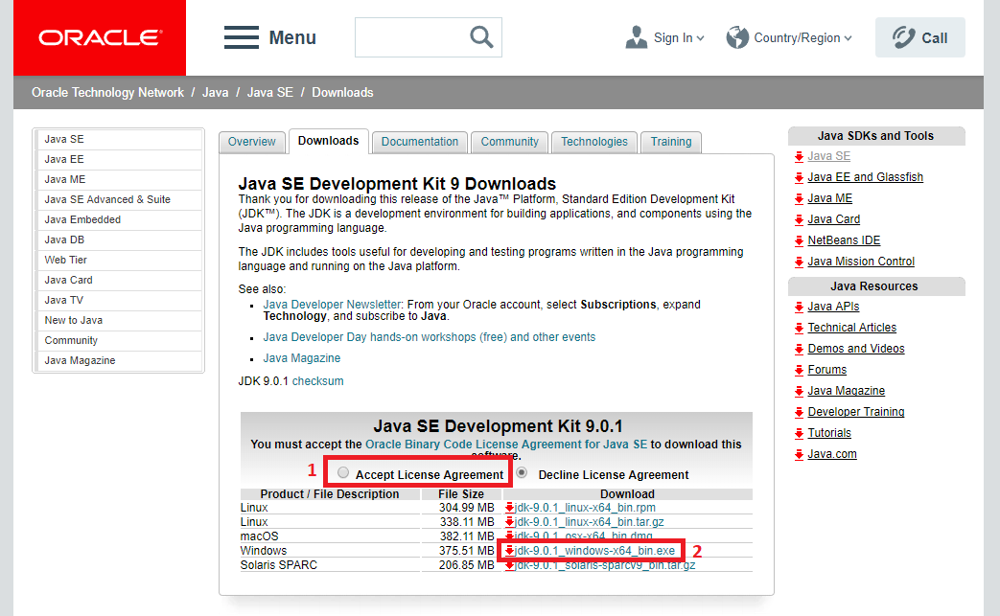
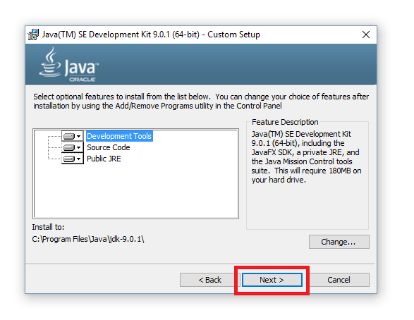

# Installation

## Installing the Java Development Kit (JDK)

In order to program Java applications, it is necessary to install the Java Development Kit (JDK), which is a program development environment.

1. Go to the Oracle Java SE downloads page http://www.oracle.com/technetwork/java/javase/downloads/index.html
2. Then click on the top left button for downloading the Java JDK. At the time of writing this book, the latest version was "Java Platform (JDK) 9". In your case it may be a different version. 

3. Tick "Accept Licence Agreement" (by default this is not ticked, so you must tick it). Then, click on the download file, which in this example for Windows is jdk-9.0.1_windows-x64_bin.exe. Please note, this is for Windows 64-bit. If you have Windows 32-bit, then you must download an older version of Java JDK e.g. Java JDK 8 (by going back to the previous page) because Windows 32-bit is not supported by Java JDK 9 and onwards. Also, if you have a different operating system (e.g. Linux, macOS) please select the corresponding download file. 

4. A popup should appear, asking you to Save the file. You can choose any folder where you want to save this download file. Click on "Save". 

5. Wait for some time. When the download has been finished, double-click the file: 

6. The Installation Wizard appears, click on "Next": 

7. Optionally, you can change the optional features and/or installation directory. Click on "Next": 

8. Wait for some time: 

9. You may optionally customize the location for JRE. Click on "Next". 

10. There should be a message with sentence "Successfully Installed". Click on "Close". 