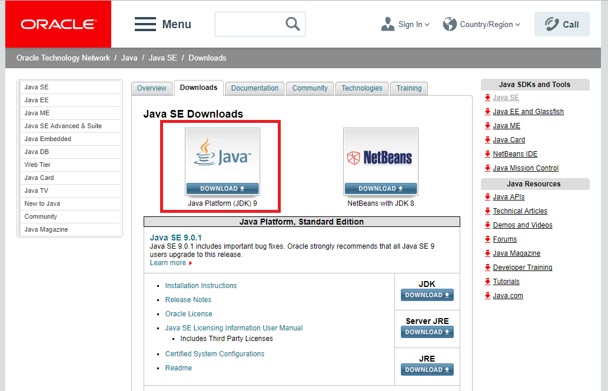
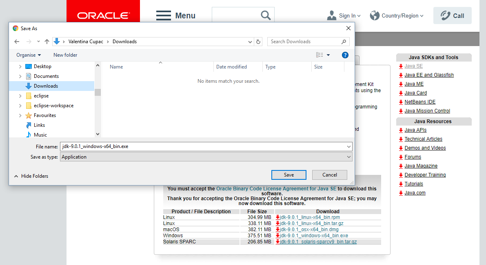
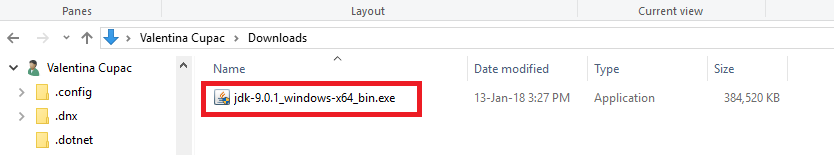
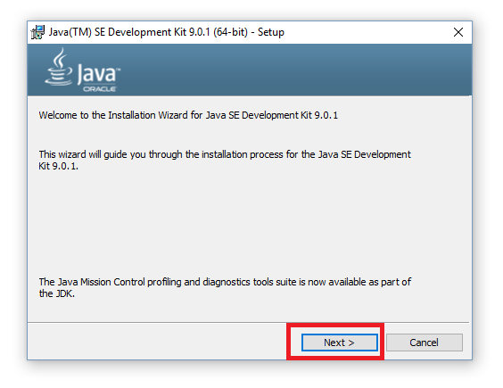
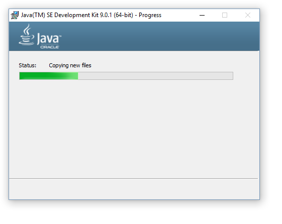
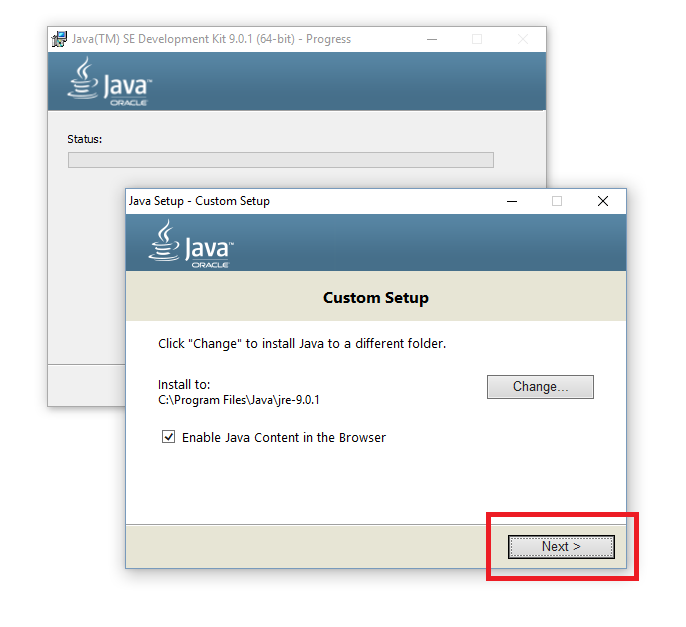
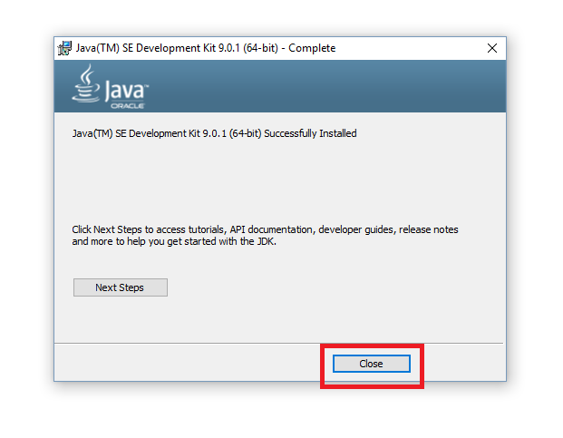

# Инсталација

## Инсталација Java Development Kit (JDK)

Да би смо програмирали у Јави, потребно је да инсталирамо Java Development Kit (JDK), окружење за развој програма.

1. Отворите страницу "Oracle Java SE downloads" http://www.oracle.com/technetwork/java/javase/downloads/index.html
2. Кликните на горње лево дугме да би сте преузели Java JDK. У време када се писала ова књига, најновија верзија је била "Java Platform (JDK) 9". У Вашем случају, можда је нека друга верзија. 

3. Обележите "Accept Licence Agreement" (подразумевана верзија није обележена, потребно је да је обележите). Онда, кликните да преузмете фајл, које у овом примеру за Windows је jdk-9.0.1_windows-x64_bin.exe. Молим обратите пажњу, да је ово за Windows 64-bit. Уколико имате Windows 32-bit, онда морате преузети старију верзију Java JDK, например Java JDK 8 (вратите се на предходну страну) зато што Windows 32-bit није подржан од стране Java JDK 9 и надаље. Такође, ако имате неки други оперативни систем (например Linux, macOS), потребно је да презузмете одговараћући фајл. 

4. Појавиће се прозорчић, који ће Вас питати да се сазува фајл. Можете да изаберете локацију где ће да се сачува преузет фајл. Кликните на "Save". 

5. Сачекајте неко време. Кда се презузимање заврши, кликните два пута на фајл: 

6. Пријваће се Installation Wizard, онда притисните на "Next": 

7. Опционо, можете променити опционе карактеристике и/или инсталациони директориујум. Кликните на "Next": 

8. Сачекајте неко време: 

9. Можете опционо прилагодити окацију за JRE. Кликните на "Next". 

10. Требало би да се појави реченица "Successfully Installed". Кликните на "Close". 